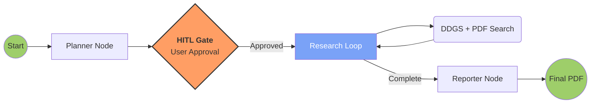

# 🧠 Autonomous Cognitive Research Engine 
### *Deep Research & Long-Horizon Task Execution*

ACRE is an autonomous research system designed to simulate the workflow of a professional analyst. Unlike simple chatbots, it understands a high-level goal, breaks it into logical sub-tasks, gathers data from multiple sources and synthesizes a structured report with human oversight.

## 🚀 System Capabilities
Built for the **Autonomous Cognitive Engine **, this system demonstrates how modern GenAI agents can handle long-horizon tasks through structured state management.

* **Strategic Goal Decomposition**: The system uses a `planner` node powered by `Llama-3.2-1B` to break vague objectives into three specific search queries before taking any action.
* **Hybrid Memory (RAG)**: Integrates a local **FAISS** vector store with `SentenceTransformers` to allow the agent to retrieve context from user-uploaded PDFs alongside real-time web data.
* **Human-in-the-Loop (HITL)**: Implements a mandatory decision gate where the agent pauses to present its research plan for user approval before execution.
* **State-Graph Orchestration**: Managed by `LangGraph`, the engine maintains a persistent `AgentState` that tracks findings and progress across multiple cycles without losing context.

## 🏗️ Architecture & Workflow
The engine is built on a modular, node-based architecture that ensures every decision the agent makes is traceable and grounded.

### Cognitive Nodes:
* **Planner**: Translates a high-level research topic into a 3-step executable strategy.
* **Human-in-the-Loop (HITL) Gate**: A critical intervention point where the system pauses. The agent presents its proposed plan to the user for review, adjustment, or approval before any external tools are triggered.
* **Researcher**: An autonomous loop that executes tools, including DuckDuckGo Search and Local PDF Retrieval, to gather raw data based on the approved plan.
* **Reporter**: A synthesis engine that evaluates all accumulated findings and formats them into a detailed, structured Markdown report.

### 📊 System Flowchart

## 🛠️ Tech Stack
The engine utilizes a modern AI stack designed for local execution and stateful agent orchestration:

* **Large Language Model (LLM)**: `unsloth/Llama-3.2-1B-Instruct` (Optimized for local CPU/GPU inference).
* **Agent Orchestration**: `LangGraph` (State-machine based control flow for multi-step reasoning and long-horizon tasks).
* **Vector Database**: `FAISS` (Facebook AI Similarity Search) for efficient L2-based semantic retrieval and storage of document embeddings.
* **Embeddings Model**: `Sentence-Transformers` (`all-MiniLM-L6-v2`) used for high-quality local document vectorization.
* **Web Research Tool**: `duckduckgo_search` for autonomous real-time web grounding without requiring external API keys.
* **UI Framework**: `Gradio` for the interactive, user-facing Research Engine interface.
* **Document Processing**: `pypdf` for local knowledge extraction and `markdown-pdf` for synthesizing professional, downloadable reports.

## 🛡️ Responsible AI & Safety
ACRE is built with "Production Thinking" to ensure stability and reliability in research environments:

* **Hallucination Protection**: The final synthesis is strictly constrained to the specific data findings gathered during the research phase.
* **Infinite Loop Guard**: A `loop_count` constraint in the graph logic automatically terminates the agent after 5 cycles to prevent runaway execution.
* **Local-First Privacy**: Document processing and vectorization happen locally on the CPU, ensuring that sensitive information in PDFs remains private and off external servers.
* **Explainability**: Every step of the agent's plan is visible to the user before execution, meeting the "Explainability" evaluation focus.

## 📊 Evaluation Focus 
* **Explainability**: The agent displays its strategy transparently before execution, allowing for human audit.
* **Long-Horizon Stability**: Successfully maintains state during complex research tasks, through robust graph state management.
* **Cost Efficiency**: Utilizes an optimized 1B parameter model that runs locally on CPU, minimizing external API dependencies and operational costs.

